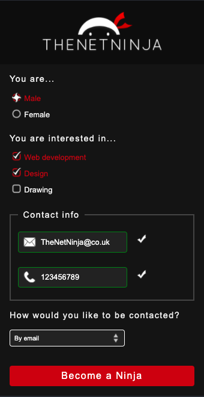

# Submit form

> I build this project with [The Net Ninja](https://youtu.be/HiHHvTcHiEk), and we changed default form styles making it more user friendly and interesting. Form page is fully responsive for all kind of devices.

<p align="center">

</p>
  
## Built With

- HTML5, CSS3
- No frameworks
- GitHub pages, VS Code, Live Server

## Live Demo

[Live Demo Link](https://ibrohimrasulov.github.io/Form-with-Net-Ninja/)

### Run tests

```
npx hint .
npx stylelint "**/*.{css,scss}"
```

## Authors

👤 **Ibrohim Rasulov**

- GitHub: [@IbrohimRasulov](https://github.com/IbrohimRasulov)
- Twitter: [@IbrohimRasu1ov](https://twitter.com/IbrohimRasu1ov)
- LinkedIn: [LinkedIn](https://www.linkedin.com/in/ibrohim-rasulov-a88352209/)

## 🤝 Contributing

Contributions, issues, and feature requests are welcome!

Feel free to check the [issues page](../../issues/).

## Show your support

Give a ⭐️ if you like this project!

## Acknowledgments

- Hat tip to anyone whose code was used
- Inspiration
- etc

## 📝 License

This project is [MIT](./MIT.md) licensed.
